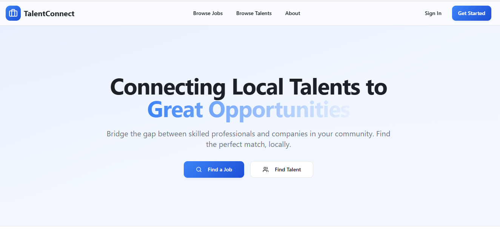

# 🌐 TalentConnect

**TalentConnect** is a modern web platform designed to bridge the gap between **skilled local professionals** and **companies** in their community.  
It provides a seamless way for users to **browse jobs**, **find talents**, and **connect** — all in one intuitive interface.

---

## 🚀 Live Demo  
🔗 **View the live project here:** [Live Demo](https://talent-connecthub.netlify.app/)  

## 🖼️ Preview  


---

## ✨ Features

- 🧑‍💼 **Job Listings:** Browse available jobs posted by verified companies.  
- 👩‍🔧 **Talent Profiles:** Discover skilled professionals available for hire.  
- 🔍 **Smart Search:** Quickly find jobs or talents using keyword search.  
- 🌈 **Responsive UI:** Fully responsive design built with Tailwind CSS and Vite.  
- 🔐 **Authentication:** Secure sign-in and registration system.  
- ⚙️ **Modern Tech Stack:** Built with React, TypeScript, and Supabase for real-time data management.  

---

## 🛠️ Tech Stack

| Category | Technology |
|-----------|-------------|
| **Frontend** | React (Vite) |
| **Styling** | Tailwind CSS |
| **Backend / Auth** | Supabase |
| **Build Tool** | Vite |
| **Language** | TypeScript |
| **Package Manager** | npm / bun |

---

## 🧩 Project Structure
talentconnect/
├── database/
├── node_modules/
├── public/
├── src/
├── .env
├── .gitignore
├── bun.lockb
├── package.json
├── package-lock.json
├── postcss.config.js
├── tailwind.config.ts
├── tsconfig.json
├── vite.config.ts
└── README.md

## ⚙️ Setup Instructions

### 1️⃣ Clone the repository
```bash
git clone https://github.com/your-username/talentconnect.git
cd talentconnect

🤝 Contributing

Contributions are welcome!
If you’d like to improve TalentConnect, please fork the repo and open a pull request.

📄 License

This project is licensed under the MIT License
.

💙 Acknowledgements

Supabase

React

Tailwind CSS

Vite

Connecting Local Talents to Great Opportunities.

